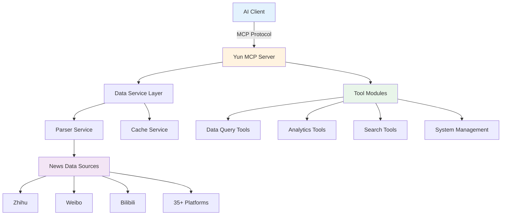
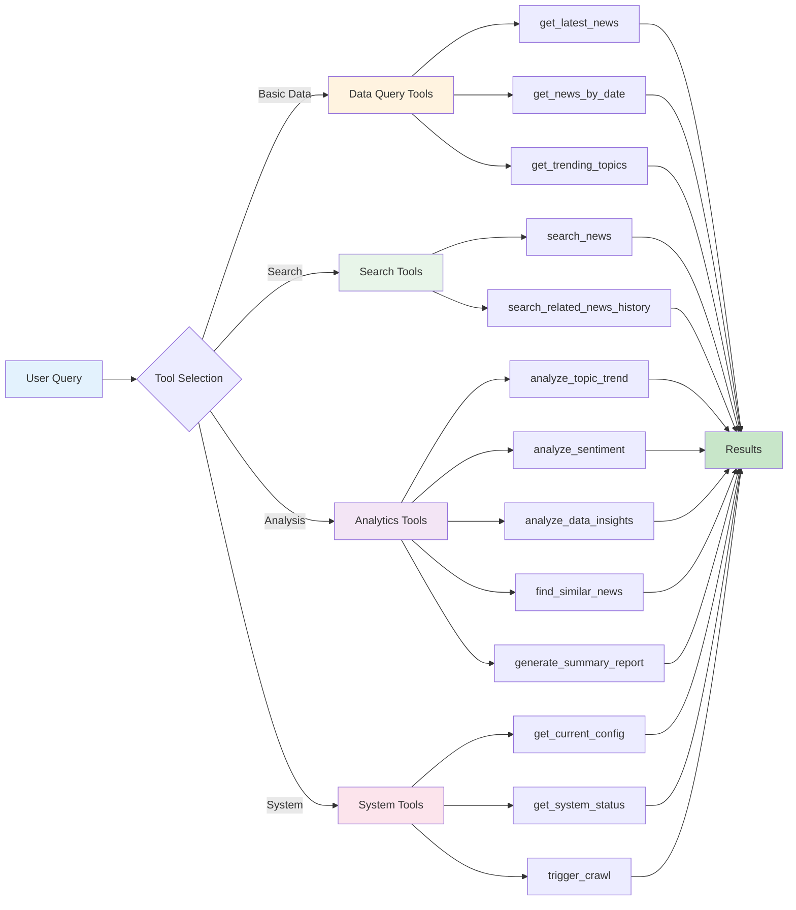
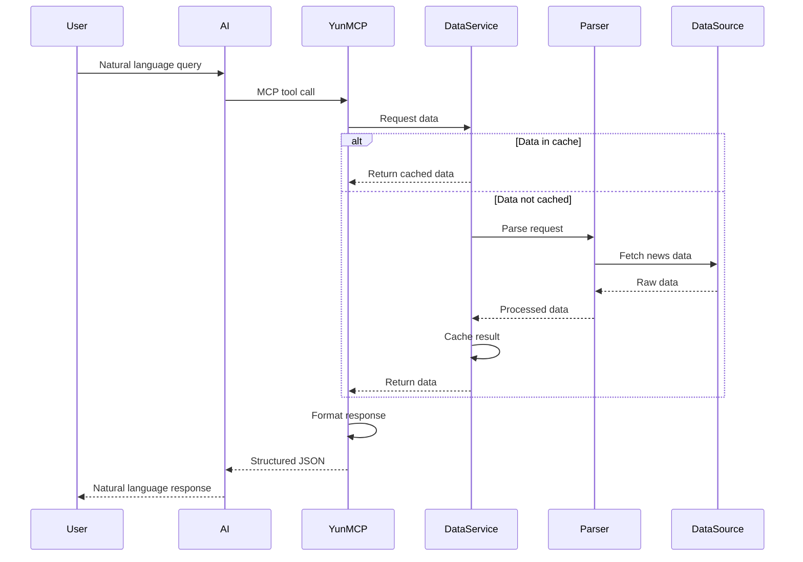
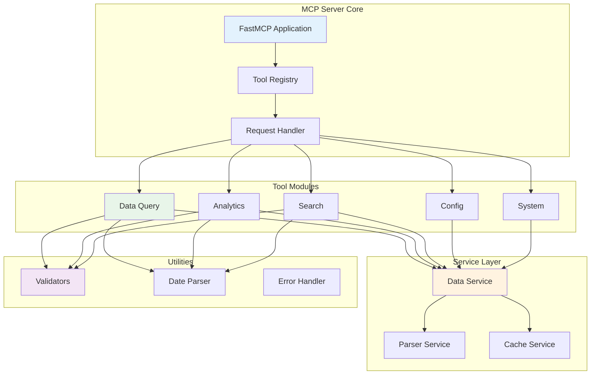

# Yun - AI-Powered News Aggregation & Analysis

<div align="center">

**Intelligent News Monitoring with MCP Protocol Support**

[](LICENSE)
[](https://github.com/we-dotcom-1/Yun)
[](https://modelcontextprotocol.io/)

</div>

---

## Overview

**Yun** is a fully functional MCP (Model Context Protocol) server for intelligent news aggregation and analysis. It provides a powerful AI interface for monitoring global news trends, analyzing sentiment, and discovering emerging topics across 35+ news platforms.

### Key Features

- **MCP Protocol Support** - Seamlessly integrate with AI assistants (Claude, Cherry Studio, Cursor, etc.)
- **13 Analysis Tools** - From basic queries to advanced trend prediction
- **Multi-Platform** - Monitor 35+ news platforms (Zhihu, Weibo, Bilibili, TikTok, etc.)
- **Smart Search** - Keyword, fuzzy, and entity-based search capabilities
- **Trend Analysis** - Track topic lifecycle, detect viral content, predict future trends
- **Sentiment Analysis** - AI-powered sentiment analysis with structured prompts
- **Cross-Platform Insights** - Compare coverage across different platforms

---

## Architecture



---

## Quick Start

### Prerequisites

- **Python 3.10+**
- **UV** (Universal Virtualenv) - [Installation Guide](https://github.com/astral-sh/uv)

### Installation

#### Windows

```batch
# Run the setup script
setup-windows.bat
```

#### Mac/Linux

```bash
# Make setup script executable
chmod +x setup-mac.sh

# Run setup
./setup-mac.sh
```

### Start the MCP Server

#### STDIO Mode (for AI Clients)

```bash
uv run python -m mcp_server.server
```

#### HTTP Mode (for Remote Access)

```batch
# Windows
start-http.bat

# Mac/Linux
./start-http.sh
```

The HTTP server will start at `http://localhost:3333/mcp`

---

## Connect to AI Clients

### Cherry Studio (Recommended for Beginners)

1. Open Cherry Studio
2. Go to **Settings** > **MCP Servers**
3. Add new server with these settings:
   - **Name**: Yun
   - **Type**: STDIO
   - **Command**: [Path to UV]
   - **Args**: `--directory [Path to Yun] run python -m mcp_server.server`

### Claude Desktop

Edit your config file (`~/Library/Application Support/Claude/claude_desktop_config.json` on Mac):

```json
{
  "mcpServers": {
    "yun": {
      "command": "uv",
      "args": [
        "--directory",
        "/path/to/Yun",
        "run",
        "python",
        "-m",
        "mcp_server.server"
      ]
    }
  }
}
```

### Cursor

Create `.cursor/mcp.json` in your project:

```json
{
  "mcpServers": {
    "yun": {
      "url": "http://localhost:3333/mcp",
      "description": "Yun News Aggregation and Analysis"
    }
  }
}
```

---

## Tool Categories & Workflow



---

## Available Tools

### Basic Data Query

| Tool | Description | Use Case |
|------|-------------|----------|
| `get_latest_news` | Get the most recent news | Quick overview of current events |
| `get_news_by_date` | Query news by date (natural language) | Historical analysis, date-specific queries |
| `get_trending_topics` | Get trending topics from watchlist | Monitor personal interests |

### Intelligent Search

| Tool | Description | Use Case |
|------|-------------|----------|
| `search_news` | Unified search (keyword/fuzzy/entity) | Find specific topics or content |
| `search_related_news_history` | Find related historical news | Discover topic evolution |

### Advanced Analysis

| Tool | Description | Use Case |
|------|-------------|----------|
| `analyze_topic_trend` | Topic trend analysis | Track heat, lifecycle, viral detection |
| `analyze_data_insights` | Platform comparison & activity stats | Cross-platform analysis |
| `analyze_sentiment` | Sentiment analysis | Public opinion tracking |
| `find_similar_news` | Find similar articles | Content deduplication |
| `generate_summary_report` | Daily/weekly summaries | Periodic reporting |

### System Management

| Tool | Description | Use Case |
|------|-------------|----------|
| `get_current_config` | Get current configuration | System inspection |
| `get_system_status` | System health check | Monitoring |
| `trigger_crawl` | Manually trigger crawling | On-demand updates |

---

## Data Flow



---

## Usage Examples

### Query Today's News

```
"Show me the top 10 news from today"
```

### Search Specific Topics

```
"Search for news about 'artificial intelligence' in the last 7 days"
```

### Trend Analysis

```
"Analyze the trend of 'Tesla' over the past week"
```

### Sentiment Analysis

```
"Analyze the sentiment of news about 'Bitcoin' from yesterday"
```

### Platform Comparison

```
"Compare how different platforms cover 'iPhone' news"
```

---

## Project Structure

```
Yun/
├── mcp_server/           # MCP Server implementation
│   ├── server.py         # Main server entry
│   ├── tools/            # MCP tool implementations
│   │   ├── data_query.py       # Data query tools
│   │   ├── analytics.py        # Advanced analytics
│   │   ├── search_tools.py     # Search functionality
│   │   ├── config_mgmt.py      # Configuration management
│   │   └── system.py           # System management
│   ├── services/         # Core services
│   │   ├── data_service.py     # Data access layer
│   │   ├── parser_service.py   # Data parsing
│   │   └── cache_service.py    # Caching layer
│   └── utils/            # Utilities
│       ├── date_parser.py      # Date parsing
│       ├── validators.py       # Input validation
│       └── errors.py           # Error handling
├── config/               # Configuration files
│   ├── config.yaml       # Main configuration
│   └── frequency_words.txt # Keyword watchlist
├── pyproject.toml        # Project metadata
├── requirements.txt      # Python dependencies
└── README.md             # This file
```

---

## Configuration

### Main Configuration (`config/config.yaml`)

Key settings:
- **Crawler settings** - Enable/disable crawling, proxy settings
- **Report mode** - Daily, current, or incremental
- **Platform list** - Which platforms to monitor
- **Weight algorithm** - Customize news ranking

### Keyword Watchlist (`config/frequency_words.txt`)

Add keywords you want to monitor:
- **Normal keywords** - Basic matching
- **Required keywords** (`+word`) - Must appear in title
- **Filter keywords** (`!word`) - Exclude from results

Example:
```
AI
ChatGPT
+technology
!advertisement
```

---

## System Architecture Details



---

## Contributing

Contributions are welcome! Please feel free to submit a Pull Request.

### Development Setup

1. Clone the repository
2. Run setup script
3. Make your changes
4. Test thoroughly
5. Submit PR

---

## License

This project is licensed under the GPL-3.0 License - see the [LICENSE](LICENSE) file for details.

---

## Acknowledgments

- Built with [FastMCP](https://github.com/jlowin/fastmcp)
- Data sourced from [NewsNow](https://github.com/ourongxing/newsnow)
- MCP Protocol by [Anthropic](https://modelcontextprotocol.io/)

---

## Support

- **GitHub Issues**: For bug reports and feature requests
- **Discussions**: For questions and community support

---

<div align="center">

**Made for the AI Community**

[Star this repo](https://github.com/we-dotcom-1/Yun) if you find it useful!

</div>
